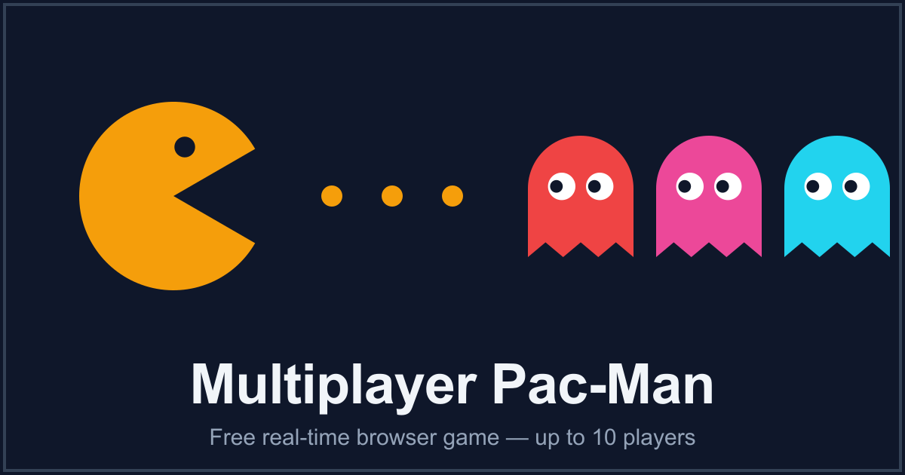

<div align="center">

# 👻 Multiplayer Pac-Man

### Real-time, browser-based multiplayer Pac-Man — up to 10 players, two teams, one authoritative server

Pac-Men race to clear the board while ghosts hunt them down. A Node/Express + Socket.IO server owns
the game state; an HTML5 Canvas client renders it with smooth interpolation.

[**▶&nbsp; Play it live**](https://pmpr.sindbug.com) &nbsp;·&nbsp; [Features](#-features) &nbsp;·&nbsp; [Quick start](#-installation) &nbsp;·&nbsp; [How to play](#-how-to-play) &nbsp;·&nbsp; [Deployment](#-deployment)

[](https://pmpr.sindbug.com)




</div>

---

Up to **10 players** share a room and split into two teams — Pac-Men race to clear the board while
ghosts hunt them down. The server resolves all movement, scoring, collisions, and win/lose conditions
and broadcasts the result to every client over WebSockets, so the client and server protocols can
never drift.

## Contents

- [Features](#-features)
- [Tech stack](#-tech-stack)
- [Installation](#-installation)
- [Running the game](#-running-the-game)
- [How to play](#-how-to-play) · [Power-ups](#power-ups)
- [Scripts](#-scripts)
- [Project structure](#-project-structure)
- [Security](#-security)
- [Deployment](#-deployment)
- [Configuration](#-configuration)
- [License](#-license)

---

## ✨ Features

- **Team-based multiplayer** — up to 10 players per room (up to 6 Pac-Men and
  6 ghosts). Ghosts win only once **every** Pac-Man has been caught.
- **Lobby with a live room list** — create or join rooms; the list updates in
  real time as rooms fill, start, and finish.
- **Role, color & map selection** — pick your side and avatar color in the
  lobby, then vote for the map; the leading map is locked in at start.
- **Six hand-tuned maps** — three big and three small boards, each gated by a
  player cap so a packed room can only vote for boards that fit.
- **Nine power-ups across two team pools** — Pac-Men and ghosts each have their
  own spawn set; you can only collect your team's items.
- **Authoritative server** — movement, the per-player move cooldown, scoring,
  collisions, power-up effects, and win/lose are all resolved server-side. The
  Socket.IO wire contract is shared and type-checked on both ends, so the
  client and server protocols can never drift.
- **Polished Canvas client** — interpolated movement, particle effects, power-up
  auras, a self-marker, and sound.

---

## 🛠️ Tech stack

| Area     | Technology                                                                                  |
| -------- | ------------------------------------------------------------------------------------------- |
| Language | TypeScript 6                                                                                |
| Server   | Node.js 22+, Express 5, Socket.IO 4.8                                                       |
| Security | helmet (CSP + secure headers)                                                               |
| Client   | HTML5 Canvas, Vite 8, Tailwind CSS 4, socket.io-client                                      |
| Tooling  | ESLint 10 (flat config) + typescript-eslint, Prettier 3, Vitest 4, tsx, Husky + lint-staged |

---

## 📦 Installation

This project uses **Yarn** (Yarn 1.x — Classic).

```bash
git clone <repository-url>
cd pacman-multiplayer
yarn install
```

Requires **Node.js ≥ 22.12**.

---

## 🎮 Running the game

### Development

```bash
yarn dev
```

This starts two processes:

- the **Express/Socket.IO server** on `http://localhost:3000` (via `tsx --watch`)
- the **Vite dev server** on `http://localhost:5173`

Open **http://localhost:5173** in your browser. The Vite dev server proxies
Socket.IO traffic (including the WebSocket upgrade) to the backend, so the client
connects with a plain same-origin `io()` call in both dev and production.

### Production

```bash
yarn build   # tsc (server) -> dist/server, vite build (client) -> dist/client
yarn start   # node dist/server/index.js
```

In production the Express server serves the built client from `dist/client` and
handles Socket.IO on the same origin (default port `3000`, override with `PORT`).

---

## 🎯 How to play

- **Arrow keys** move your character one cell at a time (a short server-side
  cooldown paces movement).
- In the **lobby**, choose your role (Pac-Man or ghost) and avatar color, and
  vote for a map. The host starts the game once there's at least one player on
  each team.
- **Pac-Men** win by collecting every pellet on the board.
- **Ghosts** win by catching every Pac-Man. A caught Pac-Man is permanently
  converted into a ghost, so the hunt only ends when no Pac-Men remain.
- Each pellet is worth **10 points**; eating a ghost while invincible is worth
  **200**.

### Power-ups

Power-ups spawn on the board roughly **every 15 seconds**, alternating between
the two team pools, and vanish if left uncollected for ~20 seconds. **You can
only pick up your own team's items** — the other team walks over them harmlessly.

**Pac-Man items**

| Power-up             | Effect                                                       |
| -------------------- | ------------------------------------------------------------ |
| 🟢 Speed Boost       | Shorter move cooldown for 10 s                               |
| 🟣 Invincibility     | For 5 s, walking into a ghost eats it (+200) and respawns it |
| 🔵 Pellet Multiplier | Pellets score double for 10 s                                |
| 🧲 Pellet Magnet     | Vacuums up nearby pellets within a 2-cell radius for 6 s     |
| ❄️ Pac-Man Freeze    | Freezes the opposing **ghosts** in place for 2.5 s           |
| 👻 Pac-Man Phase     | Pass through walls for 3 s                                   |

**Ghost items**

| Power-up        | Effect                                              |
| --------------- | --------------------------------------------------- |
| ⚡ Ghost Speed  | Shorter move cooldown for 10 s                      |
| ❄️ Ghost Freeze | Freezes the opposing **Pac-Men** in place for 2.5 s |
| 👻 Ghost Phase  | Pass through walls for 3 s                          |

---

## 📜 Scripts

| Command                        | Description                                  |
| ------------------------------ | -------------------------------------------- |
| `yarn dev`                     | Run server + Vite dev server with hot reload |
| `yarn build`                   | Build server and client for production       |
| `yarn start`                   | Run the production server                    |
| `yarn preview`                 | Preview the production client build (Vite)   |
| `yarn lint` / `lint:fix`       | Lint with ESLint                             |
| `yarn format` / `format:check` | Format with Prettier                         |
| `yarn type-check`              | Type-check server and client (no emit)       |
| `yarn quality`                 | type-check + lint + format check             |
| `yarn test` / `test:coverage`  | Run the Vitest suite                         |
| `yarn generate:assets`         | Regenerate SEO/PWA images (see below)        |

### SEO / social assets

`public/og-image.png`, the PWA icons, and the favicons are generated from pure
SVG shapes by `scripts/generate-assets.mjs` (uses the `sharp` devDependency).
The outputs are committed, so production builds never need sharp — rerun
`yarn generate:assets` only when the artwork changes.

---

## 🏗️ Project structure

```
pacman-multiplayer/
├── src/
│   ├── shared/
│   │   ├── types.ts          # Shared domain + Socket.IO event contract
│   │   └── maps.ts           # Map catalog (boards + spawn points)
│   ├── server/
│   │   ├── index.ts          # Express + Socket.IO setup, helmet, CORS, /health
│   │   ├── gameManager.ts    # Authoritative per-room game logic
│   │   ├── roomManager.ts    # Rooms / lobby management
│   │   ├── types.ts          # Server-side re-export of shared types
│   │   └── *.test.ts         # Vitest unit tests
│   └── client/
│       ├── index.html        # Vite entry
│       ├── main.ts           # Client bootstrap + Socket.IO wiring
│       ├── styles.css        # Tailwind v4 stylesheet
│       ├── core/             # Constants and client-side types
│       ├── rendering/        # Canvas renderer, entities, and effects
│       └── ui/               # Dialogs, icons, and audio
├── public/                   # Static assets (images, sounds) — Vite publicDir
├── dist/                     # Build output: dist/server + dist/client
├── vite.config.ts            # Client build + dev proxy
├── tsconfig.json             # Base TS config (extended by server/client)
├── tsconfig.server.json      # Server build (NodeNext, emits to dist)
└── tsconfig.client.json      # Client type-check (DOM libs, noEmit)
```

---

## 🔒 Security

- `helmet` sets a Content-Security-Policy and secure headers tuned for this app
  (same-origin assets, Google Fonts, the Socket.IO WebSocket, audio playback).
- CORS is locked to same-origin in production and to the Vite dev origin in
  development (never `*` together with credentials, which browsers reject).
- All client input (player names, room names, roles, colors, map votes,
  movement) is validated server-side; the server is the sole authority on game
  state.
- Room names are rendered with `textContent`, so they can't inject HTML.

---

## 🚀 Deployment

This is a **stateful realtime WebSocket app**, so it needs a host that runs a
**persistent Node process** (Render, Railway, Fly.io, a VPS…). It will **not**
work on serverless platforms like Vercel, which can't hold long-lived WebSocket
connections or shared in-memory state. One service serves both the client and
Socket.IO from the same origin.

### Render (Blueprint)

The repo includes [`render.yaml`](./render.yaml). In the Render dashboard:
**New → Blueprint → pick this repo**. It builds and starts automatically.

Equivalent manual settings (New → Web Service):

| Setting           | Value                                          |
| ----------------- | ---------------------------------------------- |
| Runtime           | Node                                           |
| Build command     | `yarn install --frozen-lockfile && yarn build` |
| Start command     | `yarn start`                                   |
| Health check path | `/health`                                      |
| Env var           | `NODE_ENV=production`                          |

`yarn` installs devDependencies regardless of `NODE_ENV`, so the build always
gets `typescript`/`vite`. Render injects `PORT` (the server reads it); no other
config is needed since the client connects same-origin.

> **Free tier note:** free Render web services sleep after ~15 min idle and
> cold-start on the next request (~30–60s). A paid instance stays warm.

### Docker (Fly.io / VPS / any container host)

```bash
docker build -t pacman-multiplayer .
docker run -p 3000:3000 pacman-multiplayer
# open http://localhost:3000
```

The [`Dockerfile`](./Dockerfile) is multi-stage (build with dev deps → slim
runtime with production deps only). Override the port with `-e PORT=8080 -p 8080:8080`.

---

## ⚙️ Configuration

| Variable        | Default                 | Description                                          |
| --------------- | ----------------------- | ---------------------------------------------------- |
| `PORT`          | `3000`                  | Port the server listens on                           |
| `HOST`          | `0.0.0.0`               | Host/interface to bind                               |
| `NODE_ENV`      | `development`           | Set to `production` to serve the built client + CORS |
| `CLIENT_ORIGIN` | `http://localhost:5173` | Allowed CORS origin in development                   |

**Browser support:** modern browsers with ES2023, WebSocket, and HTML5 Canvas support.

---

## 📝 License

ISC © Rayhan

---

<p align="center">Bugged by </p>
